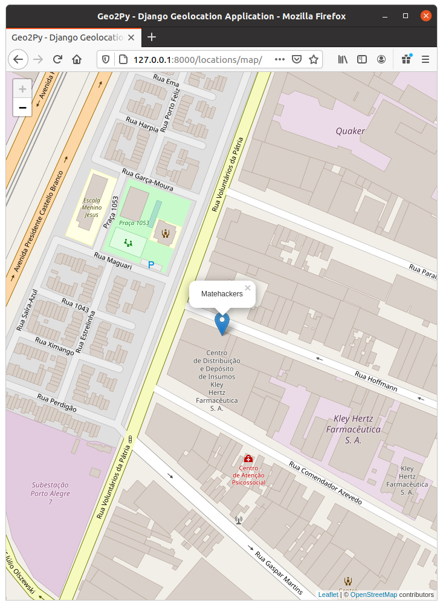

# Geo2py
Geo2py is a simple geolocation aplication made with Django, GeoDjango  and Leaflet.

## Tech
- Django
- SQLite
- GeoDjango
- Leaflet
- Open Street Map

## To-do
- Change SQLite and SpatiaLite to MySQL
- Add place details
- Create place details page

## Thanks
Thanks to @pauloxnet by your tutorial [https://www.paulox.net/2020/12/08/maps-with-django-part-1-geodjango-spatialite-and-leaflet/](https://www.paulox.net/2020/12/08/maps-with-django-part-1-geodjango-spatialite-and-leaflet/)